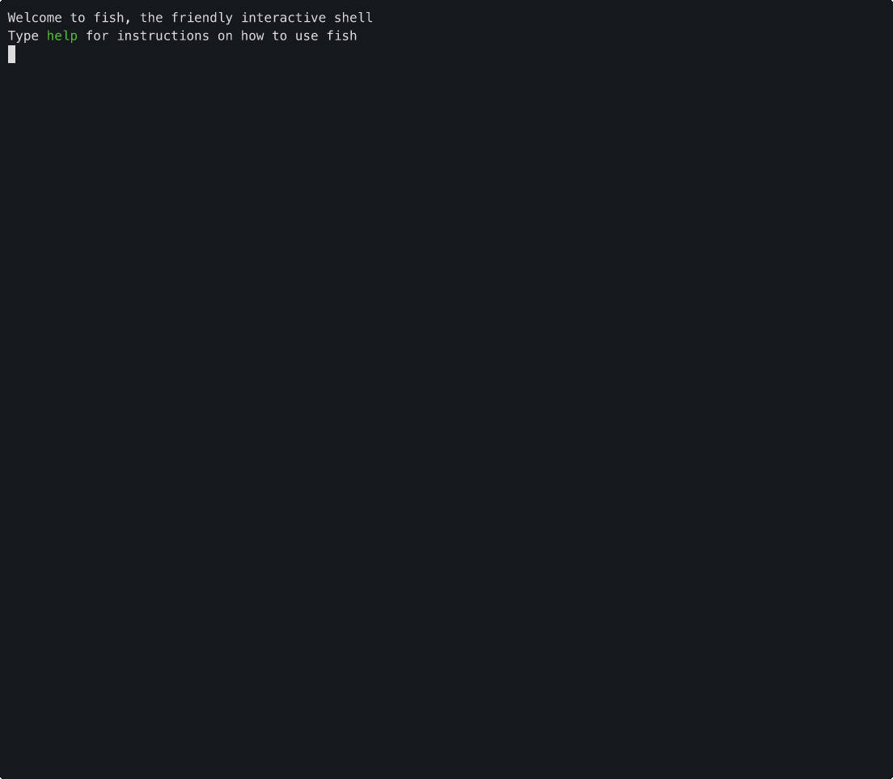

<p align="center">
  
</p>

# Svalbard

Seed vault for human knowledge — civilization on a stick.

> **Alpha (v0.1.0)** — Under active development. Presets, datasets, and curation will change significantly. Expect rough edges.

## Why

The information we take for granted today — encyclopedias, repair manuals, medical references, maps, how-to guides — might not always be a search away. Whether you're heading off-grid, preparing for disruptions, or just want a self-contained reference library that doesn't need a connection, having critical knowledge on a physical drive is surprisingly useful.

Svalbard is a one-shot provisioner for pre-built offline knowledge archives. A bugout stick. An off-grid reference library. A civilization reboot archive. Whatever you need it to be.

The project ships with sanely curated presets built from open recipes, but it's designed to be extended and modified with your own data — and that's encouraged.

## What's on a drive

- **Encyclopedias** — Wikipedia, Wiktionary, WikiMed
- **Practical knowledge** — iFixit repair guides, Stack Exchange Q&A, Practical Action field guides
- **Books and courses** — Project Gutenberg, Wikibooks, Khan Academy
- **Maps** — OpenStreetMap regional extracts, geodata overlays
- **AI models** — Portable LLMs that run locally from the drive
- **Search** — Full-text and semantic search across all content — find answers, not just keywords
- **Tools** — CyberChef, Kiwix server, everything self-contained

Deploy a 2 GB emergency kit on your phone with a few apps and be offgrid-certified. Or build a complete over-the-top 2 TB doomsday vault if you feel like it.

## How it works

A svalbard drive is not a bootable image or a compressed archive — it's a plain directory of standard open formats (ZIM, PMTiles, GGUF, HTML). No extraction, no installation. The drive includes its own binaries and tools for viewing and accessing data.

**On a computer** — plug in the drive, open a terminal, run `./run.sh`. A shell menu lets you browse encyclopedias, search across all content, view maps, chat with local AI, and launch bundled tools. Works on Mac and Linux with nothing to install on the host. Windows support is planned.

**On a phone or tablet** — carry a USB-C stick, plug it into your phone, and open the files directly with apps like Kiwix (encyclopedias), OsmAnd (maps), or any PDF/EPUB reader. Or just copy the directory (or a zip of it) to your phone's filesystem — the files are standard formats that any compatible app can open. See `provisioning/` for recommended apps on iOS and Android.

## Presets

Presets scale from pocket-sized emergency kits to full archives:

| Preset | Size | What you get |
|--------|------|-------------|
| `finland-2` | 2 GB | Emergency field kit — compact medical, water, food, and practical references |
| `default-32` | 32 GB | Core reference — Wikipedia, WikiMed, survival guides, repair manuals |
| `default-128` | 128 GB | Broad reference — adds dictionaries, books, Khan Academy, maps |
| `default-512` | 512 GB | Deep archive — adds full-picture Wikipedia, AI models, more Stack Exchange |
| `default-2tb` | 2 TB | Everything — full Wikipedia, large AI models, comprehensive coverage |

Finnish presets (`finland-*`) add Finnish-language Wikipedia, Wiktionary, Finnish maps, open geodata (recreation structures, nature reserves), and Finnish-specific guides on top of the English baseline.

## Walkthrough: provision your own stick



```bash
# 1. Install svalbard (pick one)
uv tool install git+https://github.com/pkronstrom/svalbard    # recommended
pipx install git+https://github.com/pkronstrom/svalbard        # alternative
pip install git+https://github.com/pkronstrom/svalbard          # classic

# 2. Run the wizard — walks you through region, preset, target drive, download, and indexing
svalbard wizard

# 3. Done — unplug and go
cd /Volumes/MyStick && ./run.sh     # browse, search, maps, AI chat
```

### Add your own content

`svalbard import` downloads content, transforms it as needed, and packages it into a browsable ZIM archive in `library/`. From there you can attach it to any drive.

```bash
# Import a local file — registers it as a source
svalbard import manual.pdf

# Import a website — crawls it and packages into a ZIM
svalbard import https://example.com

# Import video — downloads, transcodes, and packages into a ZIM
svalbard import https://youtube.com/watch?v=...

# Bundle multiple documents into one browsable ZIM
svalbard import --bundle my-library docs/*.pdf

# Attach to a specific drive (one-off)
svalbard attach local:my-library /Volumes/MyStick
svalbard sync /Volumes/MyStick
```

To include a source in all future drives of a preset, add it to the preset YAML instead:

```yaml
# presets/my-pack.yaml
sources:
  - ...
  - local:my-library
```

### Customize a preset

```bash
svalbard preset copy default-128 my-pack
$EDITOR ~/.local/share/svalbard/presets/my-pack.yaml
svalbard wizard --preset my-pack
```

## Commands

| Command | Description |
|---------|-------------|
| `svalbard wizard` | Interactive setup — region, preset, target, download, index |
| `svalbard sync <path>` | Download and update content |
| `svalbard status <path>` | Show drive contents |
| `svalbard audit <path>` | Coverage gap report |
| `svalbard import <input>` | Import files, URLs, or bundles into `library/` |
| `svalbard attach / detach` | Add or remove sources from a drive |
| `svalbard index <path>` | Build cross-content search index |
| `svalbard preset list / copy` | List or customize presets |

## Roadmap

- [x] Interactive wizard — region, preset, target drive, download, indexing
- [x] Parallel downloads with resume and checksum verification
- [x] Composable presets with inheritance and regional packs
- [x] Full-text and semantic search across all ZIM content
- [x] Content import — local files, websites, video, multi-doc bundles
- [x] Drive toolkit — run.sh shell menu, Kiwix server, bundled tools
- [x] Coverage audit reports
- [ ] Fully curated and verified presets — every source checked, sized, and tested across tiers
- [ ] Regional geodata packs — Finnish survival layers (shelters, water, foraging) as a first regional pack
- [ ] Search across all content — index PDFs, geodata, and reference databases alongside ZIMs
- [ ] RAG — query all drive content through the bundled local LLM
- [ ] Offline routing — turn-by-turn navigation from preprocessed OSM graphs
- [ ] Offline coding assistant — bundled LLM + editor (opencode) as a self-contained dev environment
- [ ] Mobile workflow — guides and tooling for viewing drive content on phones via USB-C
- [ ] Hardware and programming toolkit — offline compilers, embedded toolchains, EDA tools, and documentation
- [ ] Go-based drive toolkit — replace shell scripts with portable static binaries
- [ ] Limited Windows support

## Documentation

- [Usage guide](docs/usage.md) — detailed CLI reference, presets, workspace model

## License

[GPL-3.0](LICENSE) — Free to use, modify, and distribute. Derivatives must remain open source. Individual datasets on provisioned drives carry their own licenses.
